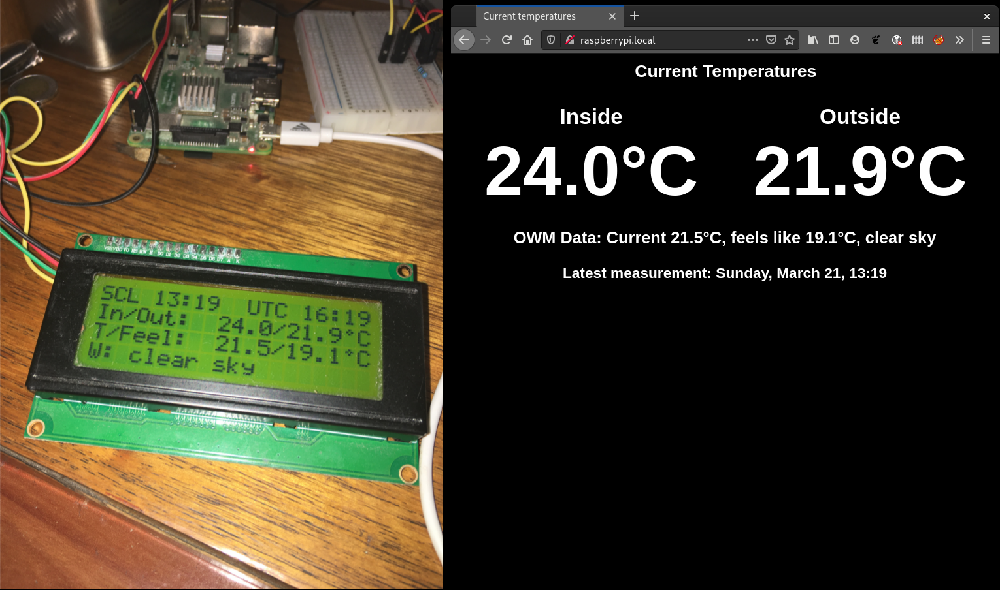

# raspberry-temperature-rust

This personal, COVID-19 crisis-born project, aims to provide an embedded
platform for internal and external environmental temperature. Starting as a
[Python project](https://github.com/injcristianrojas/raspberrypi_temperature),
it evolved to Rust based in my learning needs. The platform has
the following components:

* Two DS18B20 temperature sensors, one for interior measurements, the other for
exterior.
* An [OpenWeather API](https://openweathermap.org/api) connection for temperature comparisons and current
condition.
* A web server (Rocket) for temperature display inside my network.
* A HD44780 LCD display (with an I2C _backpack_) for instant temperature
information.



# Setup

## Hardware

For now, I will point to
[this article](https://www.circuitbasics.com/raspberry-pi-ds18b20-temperature-sensor-tutorial/)
for hardware setup.

## Software

You will need a cross-platform Rust builder. Since I work using Fedora, and
its repositories don't have the proper ARM compiling tools,
[Cross](https://github.com/rust-embedded/cross) is a great option for 
cross-compiling. My configuration is based on Podman, and the corresponding 
Dockerfile is included.

## Database

Create an sqlite3 database using: `cat database.sql | sqlite3 temps_db.sqlite`

## API Setup

Open a OpenWeatherMap API account. The
[free tier](https://openweathermap.org/price) is more than enough, since the 
platform makes 1 call per minute. Be sure to note down your API key and
[city ID](https://openweathermap.org/current#cityid).

## Environment setup

Create an `.env` file that contains the following:

```
OWMAPI_KEY=<OpenWeatherMap API Key>
OWMAPI_LOCATION_ID=<OpenWeatherMap City ID>
DATABASE_FILE=<Database location>
```

Now, you're ready to compile and run.

## (Optional) Service setup

If you want it to run as a service, register it using the service definition
file (rust_temperature.service) and move it to `/etc/systemd/system/`.
Instructions for enabling and starting it are included in that file. Be sure
that `ExecStart` and `WorkingDirectory` point to the correct file and directory.

# Future work

- [x] Better web UI (more responsive)
- [x] Web graphs (past 24 hours)
- [ ] Reporting
- [ ] Some Data Science magic maybe (Machine learning-based predictions, etc.)
